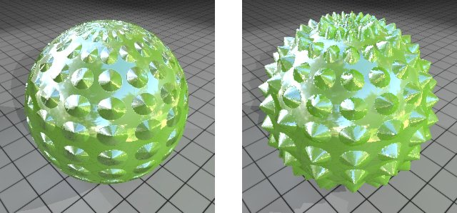

## Displacement Maps

Displacement maps **physically displace (as the name implies) the mesh to which they are applied**. In order for detail to be created based on a displacement map, usually the mesh **must be subdivided or tessellated** so real geometry is created. 

The great thing about displacement maps is that they can actually be either baked from a high resolution model or painted by hand. Like a bump map, a displacement map consists of **grayscale values**.

Displacement maps are grayscale textures you map to objects to **create true surface relief (elevations and depressions) on an otherwise flat object**.

> Now, here’s the not so great thing about displacement maps. Creating all that additional geometry in real time is extremely difficult and hard on your system. Because of this, most 3D applications calculate final displacement results at render time. 
> In comparison to bump or normal maps, a displacement map will also add significant time to your renders. As a result of this additional geometry, it’s hard to beat the results of a displacement map. Since the surface is actually modified, the silhouette reflects the additional geometry. You should always weigh the expense of a displacement map against the added benefit before deciding to use one.

“置换”(Displacement)贴图是**灰度纹理**，可将它们**映射到对象以在其他平面对象上创建出真实的表面起伏**（仰角和凹地）。

使用“置换”(Displacement)贴图，**凹地和仰角会变成对象的几何体的一部分**，从而会**更改拓扑**，这与“凹凸”(Bump)贴图不同，凹凸贴图**仅创建表面的错觉**。

置换贴图焕发了纹理的生机:  

- 阴影
- 细节更丰富
- 轮廓线
- 更好的深度感

置换映射是一种有别于视差映射, 法线映射和凹凸映射的纹理制作方法, 因为其利用的是带纹理的曲面上的点(网格)的置换来创建一种有深度有起伏的效果.也就是说, 您在对象上设置的多边形会根据高度贴图或深度贴图来移动. 

- 因为置换会更改对象的几何体，所以置换贴图对象通常需要进一步细分（多个三角形，渲染器使用它们来近似曲面的平滑度）。默认情况下，Maya 使用基于特征的置换贴图在所需的位置自动添加更多的三角形。
- 
- 用于置换贴图的文件纹理通常是通过其“outAlpha”属性连接的。如果相应的纹理图像文件未提供 Alpha 通道，那么在使用某些图像格式时，置换效果可能会丢失。

因为“置换”(Displacement)贴图会创建真正的表面起伏，所以：

-   置换贴图可以投射或接收阴影
-   如果使对象呈现暗色轮廓，则可以看到置换贴图
-   置换贴图需要花费比凹凸贴图（创建表面起伏的错觉）更多的时间来渲染

> 置換貼圖是使用高度圖將經過紋理化的表面上實際幾何點位置**沿著表面法線根據保存在紋理中的數值進行移位**的技術

凹凸贴图和置换贴图均可为材质添加逼真的三维效果，无需创建几何图形。例如，砖墙材质定义中包含的凹凸贴图会在渲染图像中产生逼真的砌砖，无需对砖和灰泥进行建模。

但是在几何图形的边缘，凹凸贴图并不逼真。在这些位置，会显示底层几何图形的线，不会显示凹凸贴图。另一方面，置换贴图首先模拟用于创建置换贴图的几何图形，然后显示置换贴图几何图形（代替底层元素）。下图清楚地显示了这一点，左图应用了凹凸贴图，而右图则采用了置换贴图。

凹凸贴图（左）和置换贴图（右）对比

### ref 
https://www.pluralsight.com/blog/film-games/bump-normal-and-displacement-maps

https://zh.wikipedia.org/wiki/%E4%BD%8D%E7%A7%BB%E8%B4%B4%E5%9B%BE

https://3dcoat.com/cn/articles/article/displacement-map-in-3dcoat/

https://help.autodesk.com/view/MAYACRE/CHS/?guid=GUID-E7A03E4E-8C9A-4B62-8218-28FC063A82AB

https://docs.bentley.com/LiveContent/web/MicroStation%20Help-v13/zh-cn/GUID-FA4B22F6-B6DB-E42D-297D-C9086D7ECA9C.html

